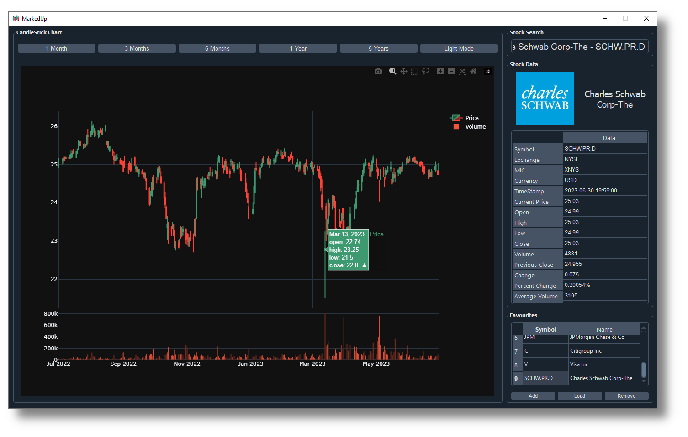
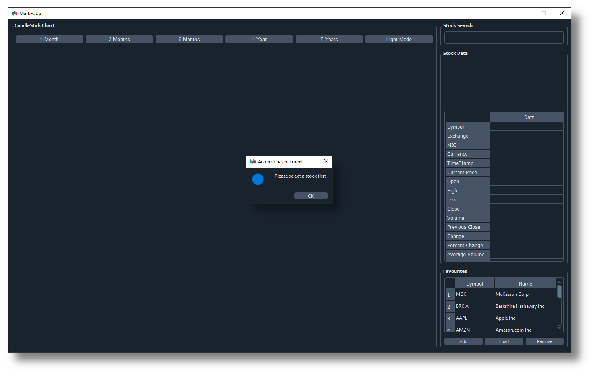
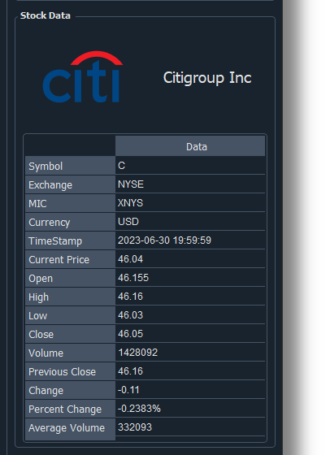
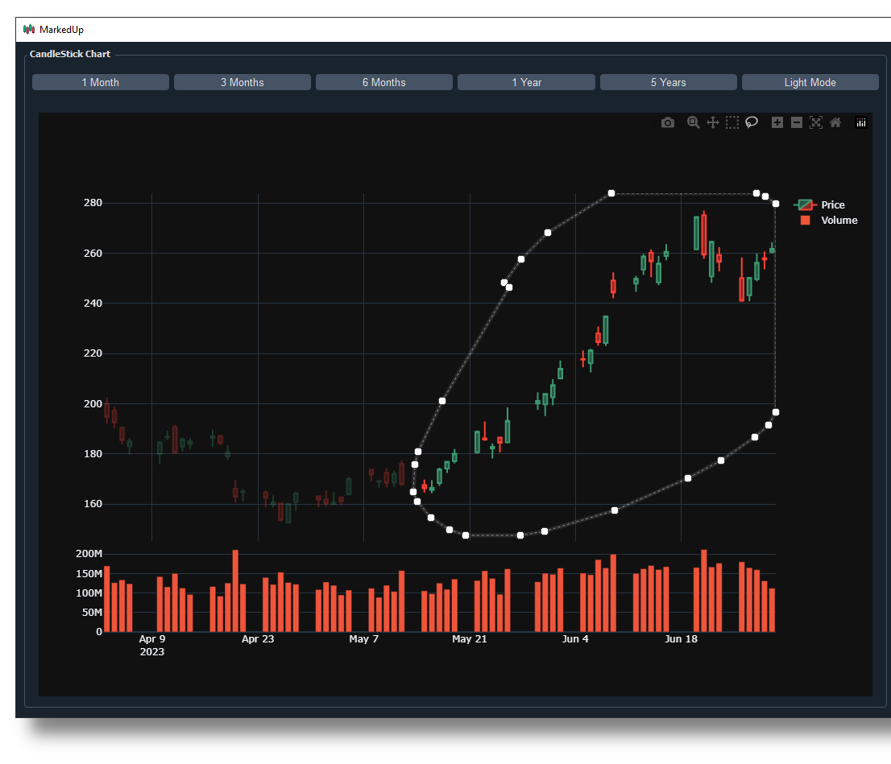
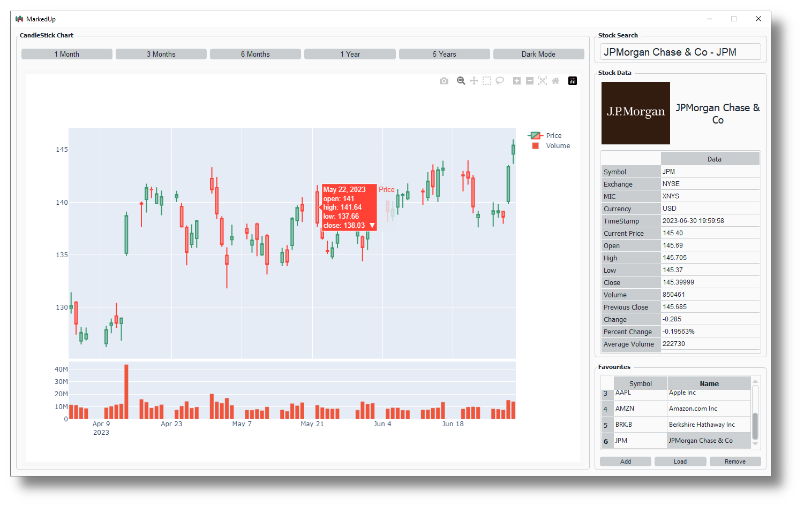

# MarkedUp

## Introduction
A desktop stock viewer that utilizes the excellent TwelveData API as the data source. It provides all relavent information for over 20,000 stocks with a clean, easy to use user interface:

## Goals
The goal was to create a great looking stock viewer that utilized a reputable API as it's source. It was a great way for me to improve my skills with common Python tools such as `pandas`, `plotly`, and `PyQt5`.

## External Libraries
The following python libraries are used in this project:

| Library        | Used For                                                            |
| -------------- | ------------------------------------------------------------------- |
| `pandas`       | Managing stock data retrieved from the TwelveData API               |
| `PyQt5`        | Creating the entire user interface.                                 |
| `plotly`       | Graphing the interactive candlestick chart.                         |
| `twelvedata`   | Getting stock data to display.                                      |
| `os`           | Checking file system paths and files in the application directory.  |
| `json`         | Creating and managing json files.                                   |
| `sys`          | Interacting with operating system for desktop application creation. |
| `datetime`     | Create and manage dates and times.                                  |
| `relativedata` | Calculate dates relative to the given date.                         |
| `threading`    | Run functions on multiple threads (multithreading).                 |
| `qdarkstyle`   | Styling user interface with KDE-like Breeze colour themes.          |

## Code Files
The program source code has been broken down into 3 files. Admittedly, I should probably split the `gui.py` file into seperate files because it is too large (600+ lines):

| File            | Contains Code For                                             |
| --------------- | ------------------------------------------------------------- |
| `gui.py`        | Creating the user interface.                                  |
| `connection.py` | Connecting and analyzing the data from the TwelveData API     |
| `main.py`       | Cleaning up temporary files and then starting the application |

## Initial Setup
Upon startup for the first time, the program will create the following files:

| File                    | Contains                                                                                                  |
| ----------------------- | --------------------------------------------------------------------------------------------------------- |
| `all_stocks.json`       | Stock Identification Information for all stocks from TwelveData API. Used for autocomplete functionality. |
| `saved_favourites.json` | Favourite Stocks Information. Originally starts off empty.                                                |

The `all_stocks.json` file in particular causes the first time launch of the application to take longer than consecutive launches, because it is loading a file with around over 100,000 lines! Each time you open the application, you will see the "blank view", because you must select a stock to view before any data is loaded. You can select the stock either by searching for it in the stock search bar or by loading a stock from the favourites tab. If you attempt to load a graph before selecting a stock, you will recieve an error:

## Features
I designed MarkedUp to have all the possible features I would want in a stock viewer, and to be easy enough such that anyone can use it to view data.

### Data Table

The main stock data is shown in the right sidebar in an organized data table. The columns and headers are colour coded for easy differentiation. A timestamp is provided to show when the data was last updated. The price data includes the current price and the price statistics for the last market closure.

### Candlestick Chart

An essential part of any stock viewer is the candlestick chart, which allows the user to see trends of a stock's movement via the open and close price. MarkedUp includes industry standard candlestick charting features to the left of the application. When you first view a stock, you the default candlestick chart that appears is the three month chart. Above the graph, there are 5 buttons to select the correct scaling and view for the user, ranging from 1 month to 5 years. The candlestick charts are built on the plotly library and have the following features:

* Candlestick annotations
* Selection zoom
* Panning
* Box select
* Lasso select
* Chart aoom
* Autoscale
* Reset axes
* Trading Volume underneath candlestick chart

Plotly graph are built on json, exported to html, and are viewed in a web browser. Therefore, MarkedUp actually uses `QtWebEngine` to view these graphs, unlike a dedicated graph window provided by most graphing libraries, such as `matplotlib`.

### Stock Search Autocomplete

In order to select which stock to view, MarkedUp includes a comprehensive stock search

### Favourites List

### Multithreading

### User Interface

### Light Mode

## Limitations

## Features to Implement in the Future