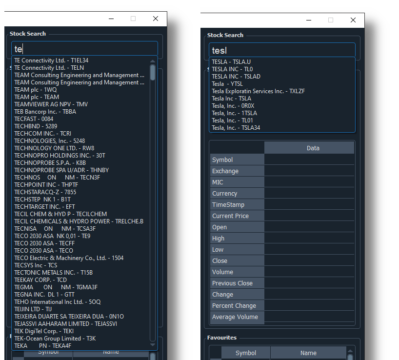
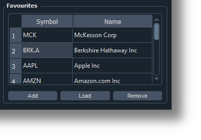
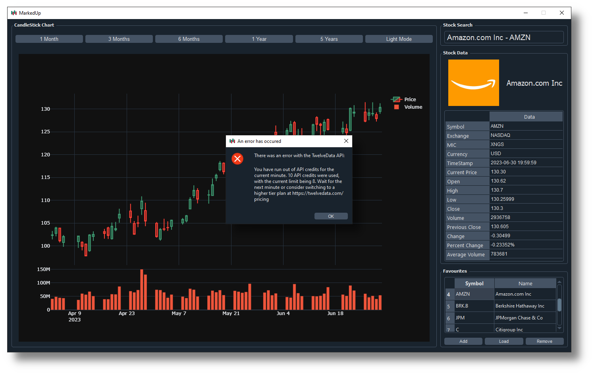

# MarkedUp

The logo contains an icon from [www.flaticon.com](https://www.flaticon.com/):

<a href="https://www.flaticon.com/free-icons/candlestick" title="candlestick icons">Candlestick icons created by andinur - Flaticon</a>

## Introduction
A desktop stock viewer that utilizes the excellent TwelveData API as the data source and the `PyQt5` library with the Qt framework for the GUI. It provides all relevant information for over 20,000 stocks with a clean, easy to use user interface:

## Goals
The goal was to create a great looking stock viewer that utilized a reputable API as it's source. It was a great way for me to improve my skills with common Python tools such as `pandas`, `plotly`, and `PyQt5`.

## External Libraries
The following python libraries are used in this project:

| Library        | Used For                                                            |
| -------------- | ------------------------------------------------------------------- |
| `pandas`       | Managing stock data retrieved from the TwelveData API               |
| `PyQt5`        | Creating the entire user interface.                                 |
| `plotly`       | Graphing the interactive candlestick chart.                         |
| `twelvedata`   | Getting stock data to display.                                      |
| `os`           | Checking file system paths and files in the application directory.  |
| `json`         | Creating and managing json files.                                   |
| `sys`          | Interacting with operating system for desktop application creation. |
| `datetime`     | Create and manage dates and times.                                  |
| `relativedata` | Calculate dates relative to the given date.                         |
| `threading`    | Run functions on multiple threads (multithreading).                 |
| `qdarkstyle`   | Styling user interface with KDE-like Breeze colour themes.          |

## Code Files
The program source code has been broken down into 3 files. Admittedly, I should probably split the `gui.py` file into separate files because it is too large (600+ lines):

| File            | Contains Code For                                             |
| --------------- | ------------------------------------------------------------- |
| `gui.py`        | Creating the user interface.                                  |
| `connection.py` | Connecting and analyzing the data from the TwelveData API     |
| `main.py`       | Cleaning up temporary files and then starting the application |

## Initial Setup
Upon startup for the first time, the program will create the following files:

| File                    | Contains                                                                                                  |
| ----------------------- | --------------------------------------------------------------------------------------------------------- |
| `all_stocks.json`       | Stock Identification Information for all stocks from TwelveData API. Used for autocomplete functionality. |
| `saved_favourites.json` | Favourite Stocks Information. Originally starts off empty.                                                |

The `all_stocks.json` file in particular causes the first time launch of the application to take longer than consecutive launches, because it is loading a file with around over 100,000 lines! Each time you open the application, you will see the "blank view", because you must select a stock to view before any data is loaded. You can select the stock either by searching for it in the stock search bar or by loading a stock from the favourites tab. If you attempt to load a graph before selecting a stock, you will receive an error:

## Features
I designed MarkedUp to have all the possible features I would want in a stock viewer, and to be easy enough such that anyone can use it to view data.

### Data Table

The main stock data is shown in the right sidebar in an organized data table. The columns and headers are colour coded for easy differentiation. A timestamp is provided to show when the data was last updated. The price data includes the current price and the price statistics for the last market closure.

### Candlestick Chart

An essential part of any stock viewer is the candlestick chart, which allows the user to see trends of a stock's movement via the open and close price. MarkedUp includes industry standard candlestick charting features to the left of the application. When you first view a stock, you the default candlestick chart that appears is the three month chart. Above the graph, there are 5 buttons to select the correct scaling and view for the user, ranging from 1 month to 5 years. The candlestick charts are built on the plotly library and have the following features:

* Candlestick annotations
* Selection zoom
* Panning
* Box select
* Lasso select
* Chart zoom
* Autoscale Axes
* Reset axes
* Trading Volume underneath candlestick chart

Plotly graph are built on json, exported to html, and are viewed in a web browser. Therefore, MarkedUp actually uses `QtWebEngine` to view these graphs, unlike a dedicated graph window provided by most graphing libraries, such as `matplotlib`.

### Stock Searchbar

In order to select which stock to view, MarkedUp includes a comprehensive stock searchbar on the top right. The searchbar allows searching through over 20,000 stocks, the metadata that is stored in the `all_stocks.json` file. It also includes autocomplete features which automatically filter through all stocks via the stock name. Results are displayed in a *"stock name - stock symbol"* format. This makes it very easy to select stocks to view:

### Favourites Table

It is inconvenient to search for stocks all the time; it would be easier to have a saved list of stocks that you would like to view. Therefore, MarkedUp includes a saved favourites table on the bottom right. There are three buttons underneath the favourites table, that allow you to:

1. Add the currently viewed stock to the table.
2. Remove a selected stock from the table.
3. Load a stock from the favourites table to view.

All data used in the favourites table is stored in the `saved_favourites.json` file, so that the favourites are persistent over multiple application launches.

### Multithreading
In order to increase the performance of the application in the backend, Markup utilizes python's `threading` library to split up both the API requests and plotly graph generation. The organization of the multithreading can be explained like so:

Another improvement in the future is to use the `QThread` library to also incorporate multithreading in the `PyQt5` GUI.

### Light Mode
Of course, with modern UI applications having both light mode and dark mode, MarkedUp also had to have that. By default, it uses dark mode, but you can also click the light mode button to theme the entire UI in light mode if you like:

## API Limitations
The main limitation with MarkedUp comes from the application using the free plan of the TwelveData API. On the free plan, the following restrictions exist:
1. You ware limited to 8 API credits per minute. This means you can only view data for 2 stocks a minute.
2. You are limited to 800 API credits per day. This means you are limited to viewing 200 stocks per day.
3. Many stocks are not available (despite showing up in MarkedUp's autocomplete feature), but the ones on the main stock exchanges like NASDAQ, NYSE, LSE AND TSE are all available.

If you attempt to break these restrictions, MarkedUp will alert you:

You can find more information about the TwelveData API [here](https://twelvedata.com/pricing).

## Features to Implement in the Future
* Make stock searchbar support just *"stock symbol"* inputs rather than *"stock name + stock symbol"* inputs. This was done to implement autocomplete more easily, but with a bit more work the searchbar can be more adaptable to the former mode of input as well.
* Utilize `QThread` library for multithreading on the GUI side.
* Possibly also add ETF and Index Searching (that will be a big update)!